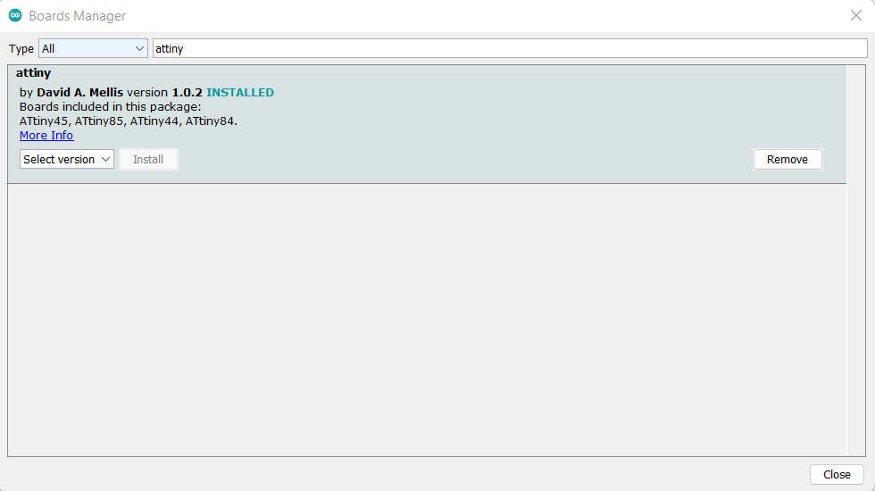

# Electronics Design

It was an exciting week as I design my very first PCB

Note about the group assignment:
I don't have group yet 😭
___

## Design 
I start by exploring **KiCad**. It's interface is beginner friendly.

Then I download and install [Fab Library](https://gitlab.fabcloud.org/pub/libraries/electronics/kicad) in KiCad.

Then I got the components from the **Fab library** and connect them using labels to make it easy to trace what is connected where ^.^


It doesn't take me much time to connect everything together in the schematic. 

On the other hand it took me a couple of days to connect all the traces together and be satisfied about it also I used 0 ohm resistor as a bridge.


___

## Milling
 
I used **GerbV** to prepare my layers.


Then I used **Gimp** to edit the images.


Then I used **[Mods](https://mods.cba.mit.edu/)** to generate **G-Code**.


Then I used the China Router to mill my PCB 


I Used 0.4mm V-bit to mill the traces and 1.2mm endmill bit for the outline.


### Hero Shot ♥
After stuffing the components

___

## Programming

I didn't make **FabISP** so I used Arduino UNO and I used ArduinoISP sketch to program my hello world board 


Then I added 

"https://raw.githubusercontent.com/damellis/attiny/ide-1.6.x-boards-manager/package_damellis_attiny_index.json"

to my Arduino IDE Preferences and then I install Attiny from boards manager 




Then I set my communication settings as following:


I connect my attiny44 echo board to ArduinoIPS as following:

| **Attiny44** | **Arduino** |
|:----------:|:-----------:|
|     RST    |      10     |
|    MOSI    |      11     |
|    MISO    |      12     |
|     SCK    |      13     |
|     VCC    |      5V     |
|     GND    |     GND     |


___
## Testing

I made this simple code to test my PCB

```
#define SW 7
#define LED 8
void setup() {
  pinMode(LED, OUTPUT);
  pinMode(SW, INPUT_PULLUP);
}

void loop() {
  if (digitalRead(SW) == LOW) {
    for (int i = 0; i < 3; i++) {
      digitalWrite(LED, HIGH);
      delay(1000);
      digitalWrite(LED, LOW);
      delay(1000);
    }
  } 
  else
  {
    digitalWrite(LED, LOW);
  }
}

```


### [See my PCB in action ♥](https://drive.google.com/file/d/1DeAW-FRbbrvwv4K2zhL2bPeFGNB1G2QT/view?usp=sharing) 


___


## Source Files:


[KiCad Files](./Files/HelloWorld-KiCad.zip)

[PCB PNGs](./Files/PNGs.zip)

[My Arduino sketch](./Files/Blink_attiny44.ino)


## Credits
♥♥♥ Thanks to all my mentors during this week ♥♥♥

[Noha Hani](http://fabacademy.org/2021/labs/egypt/students/noha-hani), 
[Omar Seif](https://fabacademy.org/2022/labs/egypt/students/omar-seif/), 
[Ahmed Saeed](http://fabacademy.org/2020/labs/egypt/students/ahmad-saeed/),
[Omar Senbisy](https://fabacademy.org/2022/labs/egypt/students/omar-abdulhameed/), 
[Amany Ayman](https://fabacademy.org/2022/labs/egypt/students/amany-ayman/)

